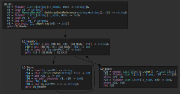
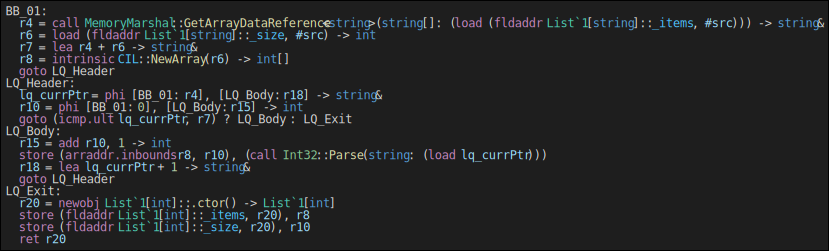
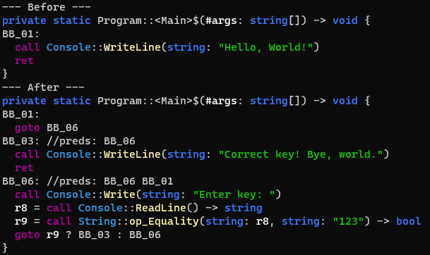
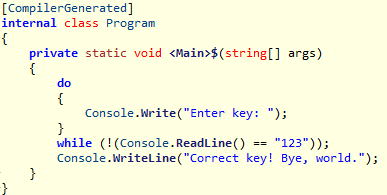
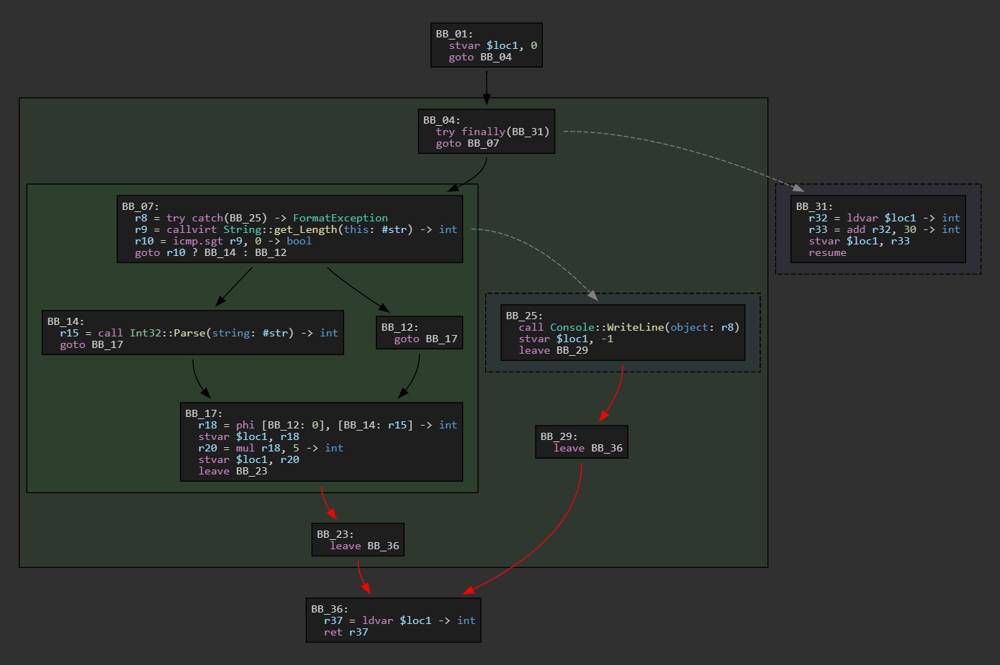

# DistIL IR and API walkthrough
The [DistIL.Core](https://www.nuget.org/packages/DistIL.Core) package contains the complete IR infrastructure and optimization passes. It is to be considered experimental and under heavy development, APIs may change without notice.

## Loading and saving modules
A module (synonymous with _assembly_) is the entry point of the type system. Loading a module from disk can be done through the `ModuleResolver` class:

```cs
var resolver = new ModuleResolver();
resolver.AddSearchPaths([Environment.CurrentDirectory]); // Search for modules in the current working directory
resolver.AddTrustedSearchPaths(); // Fallback to system modules from the current runtime
ModuleDef module = resolver.Load("Foo.dll");
// ...
module.Save("Foo_out.dll");
```

## Parsing and generating IL
Extracting and maintaining data-flow information from raw IL code is difficult and borderline impossible due to its stack-machine model, making it an unfeasible target for any reasonably complex transformation. DistIL instead works over a traditional [SSA-based intermediate representation](https://en.wikipedia.org/wiki/Static_single-assignment_form), giving it a flexible and intuitive model over the IL.

Much of the IR follows a very similar design to that of [LLVM](https://llvm.org/docs/LangRef.html), but ours have a weaker typing model and higher level semantics, matching CIL.

The API to parse IL and generate the IR graph (or vice-versa) is very straightforward as of now:

```cs
MethodDef method = module.MethodDefs().First(m => m.Name == "<Main>$"); // Find top-level program entry-point
MethodBody body = ILImporter.ParseCode(method); // Parse IL into a control flow graph
// ...
method.ILBody = ILGenerator.GenerateCode(body); // Generate IL code, taking care of register allocation and SSA-destruction
```

The freshly parsed IR will contain many variables out of SSA-form, leaving the data-flow obscured through load and store instructions. The dedicated SSA promotion pass can be applied to fix this, but it requires the setup of the `Compilation` and `PassManager` classes. See [DistIL.Cli's source](../src/DistIL.Cli/Program.cs).

The `ILGenerator` is able to generate reasonably compact IL by traversing expression trees that are implicitly built over the linear IR (by flagging SSA defs as leafs or branches). It also uses a register allocator based on a simple graph-coloring algorithm to reduce the final number of variables required.

## Dumping the IR
Taking easily readable snapshots of the IR is essential for development. DistIL supports a variety of flavors for IR dumps:

```cs
// Dump the IR into linear form to the console,
// using ANSI escape sequences for coloring.
IRPrinter.ExportPlain(body, Console.Out);

// Dump the IR CFG into a Graphviz DOT file.
// There are several ways to render these:
// - `Graphviz Interactive Preview` VSCode extension
// - Online sites such as http://magjac.com/graphviz-visual-editor
// - Graphviz CLI
// This method also accepts a list of `IPrintDecorator` objects, which is 
// currently implemented by analyses such as `LivenessAnalysis` and `RegisterAllocator`.
IRPrinter.ExportDot(body, "logs/cfg.dot");

// Dump the IR into a tree-like form to a text file.
// These trees are identical to the ones used by ILGenerator.
IRPrinter.ExportForest(body, "logs/forest.txt");
```

Here's an example of how these dumps look like, in both Graphviz and Forest formats respectively:
<div>
  
  
</div>

---

The IR can be dumped at any point through the _Immediate Window_ or _Debug Console_.

## Traversing blocks and instructions
`MethodBody` provides a simple helper for enumerating all instructions at once:

```cs
foreach (Instruction inst in body.Instructions()) {
    // ...
}
```

However, it may be the case where individual blocks need to be considered individually. This can be done using the default enumerators of `MethodBody` and `BasicBlock`:

```cs
foreach (BasicBlock block in body) {
    // ...
    foreach (Instruction inst in block) {  // or: block.Phis(), block.Guards(), block.NonPhis()
        // ...
    }
}
```

Blocks and instructions are stored in linked lists, which allows for addition and removal during an active loop without the invalidation of enumerators.

The block order is preserved from the source IL. The `MethodBody.TraverseDepthFirst()` method can be used to obtain pre and post depth-first block orderings.

## Basic pattern matching and rewriting
The basis for every analysis and transform is pattern matching. For simple needs, C# support for pattern matching can be very useful (albeit not very scalable):

```cs
// Rewrite ((x + y) - y) -> x, for all int types
if (inst is BinaryInst { Op: BinaryOp.Sub, Left: BinaryInst { Op: BinaryOp.Add } lhs, Right: var y } && lhs.Right == y) {
    inst.ReplaceWith(lhs.Left); // Replace all uses of `inst` with `x`, then delete `inst` from the method.
}
```

## Generating complex IR
While it's possible to generate IR through constructors and individual insert calls, such quickly becomes tedious. The `IRBuilder` class helps with the creation of complex sequences and control flow:

```cs
if (inst is CallInst { Method.Name: "WriteLine", Args: [ConstString { Value: "Hello, World!" }] } origCall) {
    // Note that the above will match calls to WriteLine() declared in any type.
    // More strict matching should check `Method.DeclaringType` against the imported TypeDesc.

    // Resolve used members
    TypeDefOrSpec t_Console = resolver.Import(typeof(Console));
    MethodDesc m_ReadLine = t_Console.FindMethod("ReadLine");
    MethodDesc m_Write = t_Console.FindMethod("Write", new MethodSig(PrimType.Void, [PrimType.String]));
    MethodDesc m_StrEqual = resolver.Import(typeof(string)).FindMethod("op_Equality");

    // Create a new empty block at the end of the method
    BasicBlock askKeyBlock = body.CreateBlock();

    // Split call block. Move all insts starting from `origCall` to a new block,
    // then change the old block branch to `askKeyBlock`
    BasicBlock newBlock = origCall.Block.Split(origCall, branchTo: askKeyBlock);

    // Populate `askKeyBlock`
    //   Console.Write("Enter key: ");
    //   goto Console.ReadLine() == "123" ? newBlock : askKeyBlock
    var builder = new IRBuilder(askKeyBlock, InsertionDir.After);
    builder.CreateCall(m_Write, ConstString.Create("Enter key: "));
    builder.SetBranch(
        builder.CreateCall(m_StrEqual, builder.CreateCall(m_ReadLine), ConstString.Create("123")),
        newBlock, askKeyBlock);
      
    // Rewrite existing call
    origCall.SetArg(0, ConstString.Create("Correct key! Bye, world."));
}
```



_Generated IR and decompiled output_

## Traversing value use-chains
The use-chain of every `TrackedValue` is automatically updated whenever an instruction is created or removed. They are not keept for values representing constants.

Use-chains are implicitly used to derive block successor/predecessor edges, and by helpers such as `TrackedValue.ReplaceUses()` and `Instruction.ReplaceWith()`.

```cs
// Check if all uses of an object allocation are from field accesses
if (inst is NewObjInst && inst.Users().All(u => u is FieldAddrInst)) {
    // ...
}
```

## Protected regions

<table>
  <tr> <th>Original code</th> <th>CFG</th> </tr>
  <tr>
    <td>
      <pre lang="csharp">
int Try2(string str) {
  int r = 0;
  try {
    r = str.Length > 0 
      ? int.Parse(str) : 0;
    r *= 5;
  } catch (FormatException ex) {
    Console.WriteLine(ex);
    r = -1;
  } finally {
    r += 30;
  }
  return r;
}
      </pre>
    </td>
    <td>
      
    </td>
  </tr>
</table>

_Note: this is an older screenshot taken when stvar/ldvars were still in use. They have since been replaced with normal load and store instructions._ 

Protected regions are by far the most complex aspect of the IR. They are represented as implicit sub-graphs of the main CFG, delimited by _guard_ and _leave_ instructions. Being implicit allows for many transforms to work with none or few special cases, as guard/leave instructions provide clear region boundaries without introducing indirection levels or changing the overall shape of the IR.

Exception control flow is also implicit - instructions may throw exceptions anywhere inside a basic block. SSA renaming is constrained for variables assigned inside regions, because execution could be interrupted before a definition reaches an use outside the protected region, thus invalidating the original meaning of the program.
