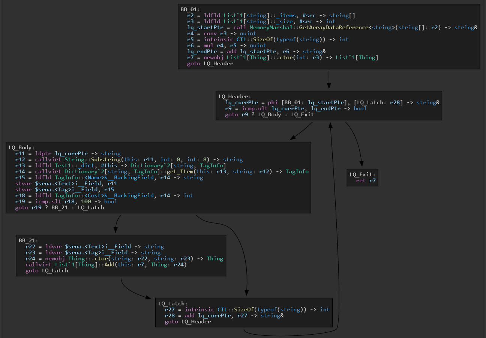

# Internals
The _intermediate representation_ is based on a traditional _control flow graph_ with instructions in _static single assignment_ form. Many ideas and implementation details were taken from LLVM, but it is otherwise specifically modeled after CIL.

The type system was designed to abstract away things like entity handles/tokens and "reference" entities, it requires the entire dependency tree of a module to be available in order to work. It uses _System.Reflection.Metadata_ for module loading and writing.

## Linq expansion

_Optimized CFG of the Linq sample in [README](../README.md)_

Though it may be perfectly possible for Linq queries (and extensions) to be optimized at a great extent by general transforms such as devirtualization, inlining, SROA/object stack allocation, and further CFG simplification; they would likely need significant tunning to work effectively. A pattern matching transform is considerably easier to implement and gives much more control over the final code, but at the inherent cost of being tied to specific library calls.

The current implementation synthesizes code from top to bottom (as in `[top] source.Select().Where().ToList() [bottom/sink]`), this allows for more flexibility in each stage, as they can behave essentially like an inner loop statement; they can skip to the next source element, exit the loop, or even start a nested loop. It eliminates the need for state machinery that would otherwise be needed to emulate an enumerator via _MoveNext()_ and _get_Current()_ methods. Lambda invocations are replaced with direct calls by another simplification pass, which may allow them to be inlined further down.

The `IgnoresAccessChecksToAttribute` makes it possible to access private members directly in CIL, something which would otherwise be impossible without changing access modifiers. It not only gives the ability to emit faster code, but it also allows for inlining to work without constraints, consequently enabling many other optimizations.

The transform does currently cause subtle behavior changes which could be observable in some cases, for example: null argument checks, concurrent modification checking done by `List<T>.Enumerator`, and lambda instance caches are eliminated. Though these details are rarely relied upon in practice, the transform could be made opt-in via attributes in the future, and/or global "safety" settings could be implemented.

## Protected regions

<table>
  <tr> <th>Original code</th> <th>CFG</th> </tr>
  <tr>
    <td>
      <pre lang="csharp">
int Try2(string str) {
  int r = 0;
  try {
    r = str.Length > 0 
      ? int.Parse(str) : 0;
    r *= 5;
  } catch (FormatException ex) {
    Console.WriteLine(ex);
    r = -1;
  } finally {
    r += 30;
  }
  return r;
}
      </pre>
    </td>
    <td>
      
    </td>
  </tr>
</table>

Protected regions are by far the most complex aspect of the IR. They are represented as implicit sub-graphs of the main CFG, delimited by _guard_ and _leave_ instructions. Being implicit allows for many transforms to work with none or few special cases, as guard/leave instructions provide clear region boundaries without introducing indirection levels or changing the overall shape of the IR.

Exception control flow is implicit, instructions may throw exceptions anywhere inside a basic block. SSA renaming is currently constrained for variables assigned inside regions, because execution could be interrupted before a definition reaches a phi instruction, the original meaning of the program would be lost.

## Code generation
The generator emits CIL code by recursively traversing expression trees formed in the IR, while assigning result values into variables assigned by the register allocator.

Building deep expression trees is important not only for code size, but also because small trees could hinder RyuJIT's ability to match patterns and perform its own optimizations, since it uses a tree-based IR (though this may be less problematic with its new _forward substitution_ pass). Since instruction operands are direct references to others, it is enough to assign each of them a flag indicating whether they are a sub-expression (implying it has a single-use), or the root of a tree (implying its result value should be stored into a temp variable).

The _register allocator_ also helps translating out of SSA form by aggressively coalescing phi arguments back into a single variable, and scheduling _parallel copies_ for arguments that cannot be coalesced. These copies are sequentialized by the generator using normal load/stores just before branches are emitted.

In some cases, the resulting code may not be optimal because there's little tunning on existing transforms, most notably _value numbering_ and _coalescing_. They present the well known problem of increasing register pressure, causing the "optimized" code to endup with more spills than the original due to more variables being alive at one point.
